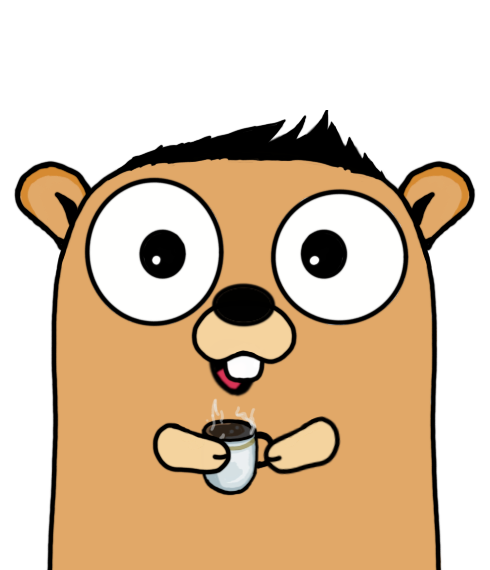

# ScheduleHorse

       
    Reads events from google calendar, and creates a database of it's values.

## About
Pulls data from google calendar, and reads it's values into datatypes.
The program then creates a database with the "databse/sql" module.

## Usage
N/A

## Installation
 `@ go get github/accnameowl/ScheduleHorse`

